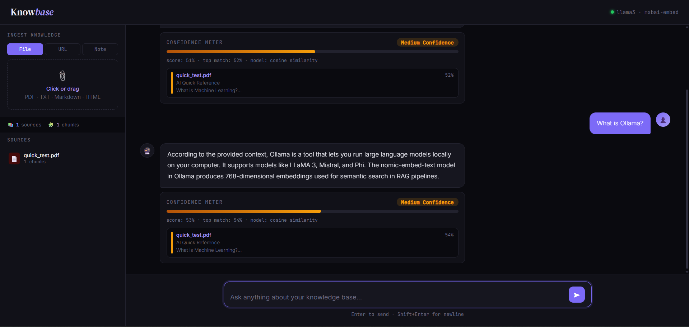

# Knowbase — Personal RAG Knowledge Assistant

A fully local Retrieval-Augmented Generation (RAG) chatbot that answers questions from your own documents. Upload PDFs, Markdown files, plain text, HTML pages, or raw notes and query them through a streaming chat interface. Every answer includes a confidence meter derived from cosine similarity scores so you always know how reliable the response is.

---

## Interface



The interface is split into two panels. The left sidebar handles document ingestion via file upload, URL fetch, or pasted notes, and lists all indexed sources with their chunk counts. The right panel is the chat area where questions are typed and answers stream in token by token. Each response is followed by a Confidence Meter showing the similarity score, confidence level, and a breakdown of which source documents contributed to the answer.

---

## Features

- **Multi-format ingestion** — PDF, TXT, Markdown, HTML, and pasted notes
- **URL fetching** — paste any public URL and the page is scraped, chunked, and indexed automatically
- **Batch embeddings** — all document chunks are embedded in a single Ollama API call for fast ingestion
- **Confidence meter** — each answer displays High, Medium, or Low confidence based on weighted cosine similarity of the top retrieved chunks
- **Streaming responses** — LLM tokens stream token-by-token via Server-Sent Events (SSE)
- **Source attribution** — every answer lists the source documents and their individual relevance scores
- **Zero external services** — vector storage uses SQLite with NumPy; no Chroma, Pinecone, or Weaviate needed
- **Source management** — add or delete sources from the UI without restarting

---

## Tech Stack

| Layer        | Technology                             |
| ------------ | -------------------------------------- |
| LLM          | Ollama — llama3:latest                 |
| Embeddings   | Ollama — mxbai-embed-large:latest      |
| Vector Store | SQLite + NumPy cosine similarity       |
| Backend      | Python, Flask                          |
| Frontend     | Vanilla HTML/CSS/JS with SSE streaming |

---

## Prerequisites

**Ollama** must be running locally with both models pulled:

```bash
ollama serve
ollama pull llama3:latest
ollama pull mxbai-embed-large:latest
```

**Python dependencies:**

```bash
pip install flask pypdf beautifulsoup4 numpy requests
```

---

## Setup and Run

```bash
git clone https://github.com/your-username/knowbase.git
cd knowbase
python app.py
```

Open `http://localhost:5000` in your browser.

No environment variables or configuration files are required. The SQLite database is created automatically at `db/knowledge_base.db` on first run.

---

## Project Structure

```
knowbase/
├── app.py              # Flask server and all API routes
├── rag_engine.py       # Embedding, chunking, retrieval, confidence scoring
├── templates/
│   └── index.html      # Frontend — single-file UI
├── db/                 # Auto-created SQLite vector store
├── uploads/            # Temporary file storage for ingestion
└── requirements.txt
```

---

## API Reference

| Method | Endpoint              | Description                         |
| ------ | --------------------- | ----------------------------------- |
| POST   | `/api/upload`         | Upload a file (PDF, TXT, MD, HTML)  |
| POST   | `/api/ingest-text`    | Ingest raw text or a note           |
| POST   | `/api/ingest-url`     | Fetch and ingest a public URL       |
| POST   | `/api/query`          | Ask a question — returns SSE stream |
| GET    | `/api/sources`        | List all indexed sources            |
| DELETE | `/api/sources/<name>` | Remove a source and its chunks      |
| GET    | `/api/stats`          | Total chunks and sources count      |
| GET    | `/api/health`         | Ollama connectivity check           |

---

## Confidence Scoring

The confidence meter is calculated as:

```
score = (top_match * 0.7) + (average_of_top_3 * 0.3)
```

| Level  | Score Threshold |
| ------ | --------------- |
| High   | >= 72%          |
| Medium | 50 - 71%        |
| Low    | < 50%           |

A low confidence score means the indexed sources do not contain strong matches for the query, and the answer should be treated with caution.

---

## Chunking Strategy

Documents are split into overlapping chunks of approximately 400 tokens (1600 characters) with an 80-token (320-character) overlap. Overlap ensures that context spanning a chunk boundary is not lost during retrieval.

Duplicate documents are detected via MD5 hash. Re-uploading an already-indexed file is a no-op.

---

## License

MIT
